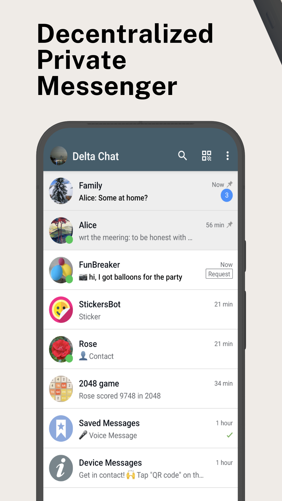
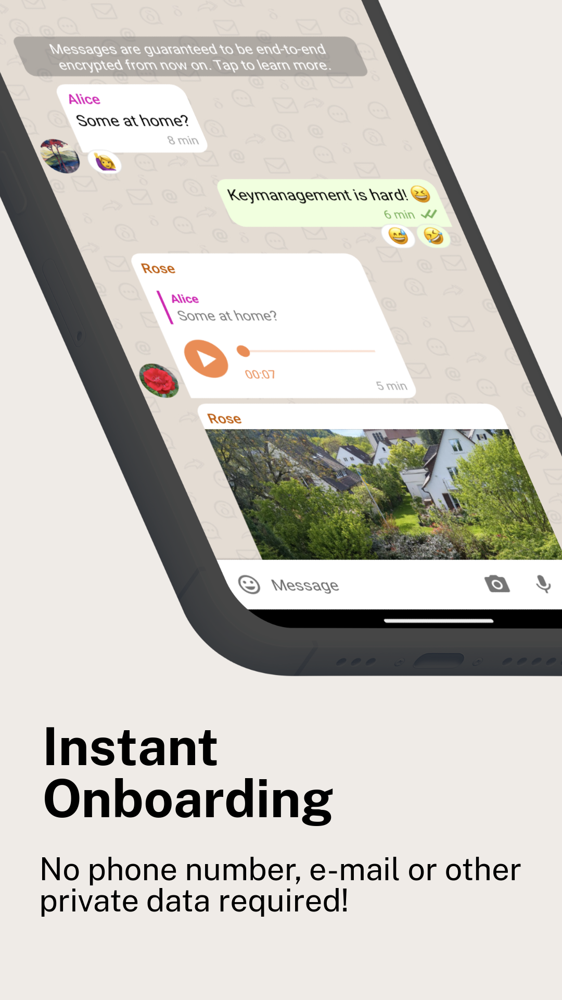

## Delta Chat Android Client

This is the Android client for [Delta Chat](https://delta.chat/).

Other download options and downloads for other platforms can be
found at [get.delta.chat](https://get.delta.chat).

For the core library and other common info, please refer to the
[Chatmail Core Library](https://github.com/chatmail/core).

For general contribution hints, please refer to [CONTRIBUTING.md](./CONTRIBUTING.md).
For building the app, refer to  [BUILDING.md](./BUILDING.md).

 

# Translations

Android metadata and changelogs are translated using [Weblate](https://hosted.weblate.org/projects/deltachat/android-metadata/).

App strings and website are translated using [Transifex](https://app.transifex.com/delta-chat/).

# Credits

Many of the user interface classes were based on the Android Signal messenger when we ported it from the former Telegram-UI base in 2019. 
Meanwhile, development has diverged in many areas. 

# License

Licensed GPLv3+, see the LICENSE file for details.

Copyright © Delta Chat contributors.
