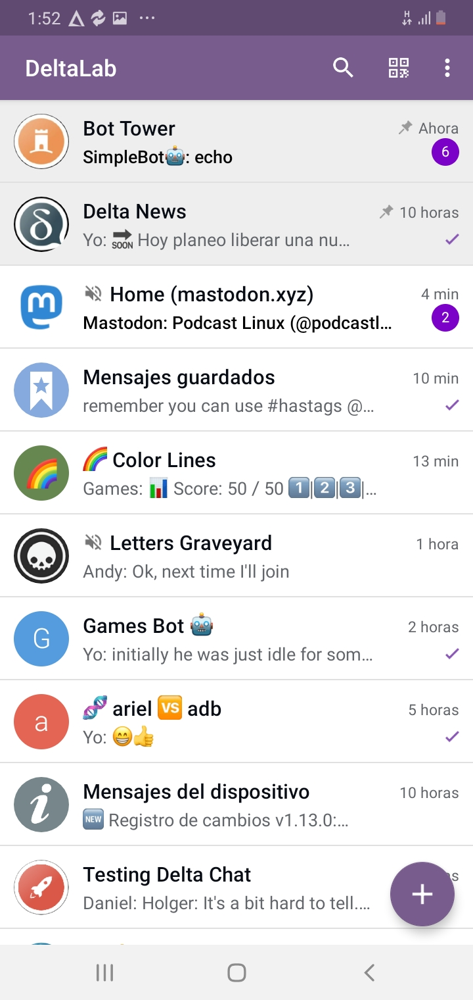
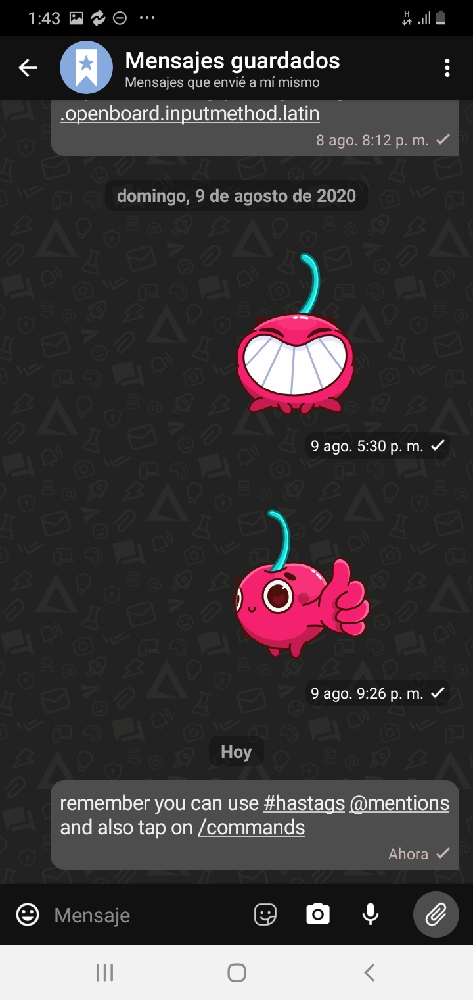

## DeltaLab Android Client

DeltaLab is a [Delta Chat](https://delta.chat/) client for Android.

DeltaLab uses a [modified](https://github.com/adbenitez/deltalab-core) version of the [Delta Chat Core Library](https://github.com/deltachat/deltachat-core-rust).

 

# Run UI Tests and Benchmarks

- You don't necessarily need a dedicated testing device.
  Backup your current account first, maybe there are some bugs in switching accounts.

- You can run benchmarks on either an emulated device or a real device.
  You need at least Android 9. For better benchmark results,
  you should run the benchmark on a real device and make sure that the core is compiled in release mode.

- Disable animations on your device, otherwise the test may fail:
  at "Developer options"
  set all of "Window animation scale", "Transition animation scale" and "Animatior duration scale" to 0x

- In Android Studio: "File" / "Sync project with gradle files"

- In Android Studio: "Run" / "Edit configurations" / "+" / "Android Instrumented test":
  Either select a specific class or select "All in Module" / "OK" /
  Select your configuration in the toolbar / Click on the green "run" button in the toolbar to run the tests

When the benchmark is done, you will get a result like
`MEASURED RESULTS (Benchmark) - Going thorough all 10 chats: 11635,11207,11363,11352,11279,11183,11137,11145,11032,11057`.
You can paste `11635,11207,11363,11352,11279,11183,11137,11145,11032,11057`
into a cell in a LibreOffice spreadsheet, do "Data" / "Text to columns",
choose `,` as a separator, hit "OK", and create a diagram.

# Credits

DeltaLab is based on the [official Delta Chat client](https://github.com/deltachat/deltachat-android) with some small improvements.

# License

Licensed GPLv3+, see the LICENSE file for details.

Copyright © 2020 DeltaLab contributors.
