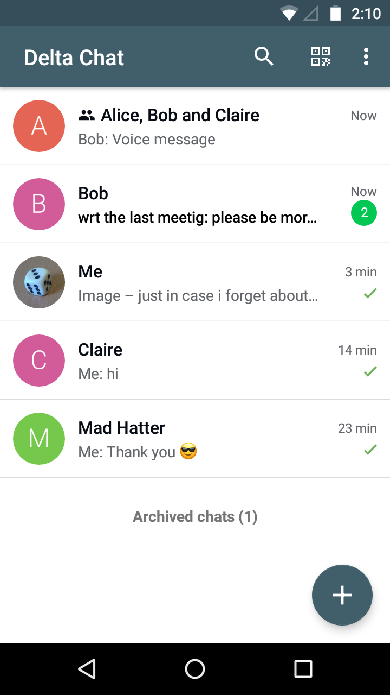
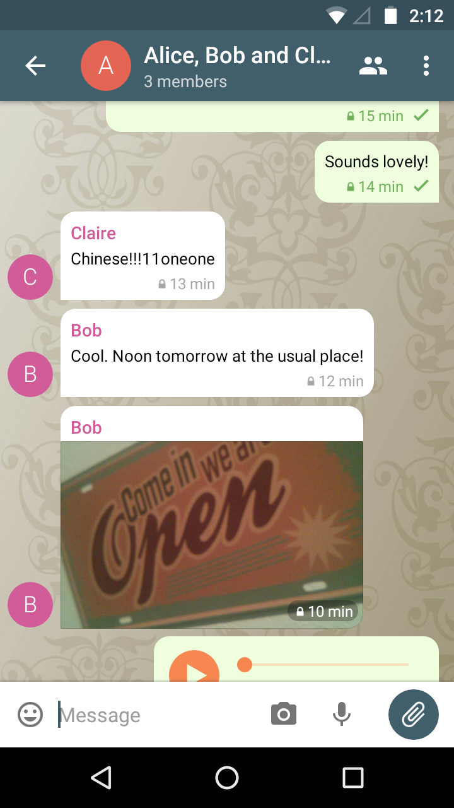

## Delta Chat Android Client

This is the Android client for [Delta Chat](https://delta.chat/).
It is available on [F-Droid](https://f-droid.org/app/com.b44t.messenger) and
the [Google Play Store](https://play.google.com/store/apps/details?id=chat.delta).
The APK can also be downloaded from [GitHub](https://github.com/deltachat/deltachat-android/releases)
(only for experienced users).

For the core library and other common info, please refer to the
[Delta Chat Core Library](https://github.com/deltachat/deltachat-core-rust).

 


# Check Out Repository

When checking out _deltachat-android_, make sure also to check out the
subproject _deltachat-core-rust_:

- When using Git, you can do this initially by
  `$ git clone --recursive https://github.com/deltachat/deltachat-android`
  or later by `git submodule update --init --recursive`. If you do this in your
  home directory, this results in the folder `~/deltachat-android` which is just fine.

# Build Using Dockerfile

If you only want to build an APK, the easiest way is to use
provided `Dockerfile` with [Docker](https://www.docker.com/) or
[Podman](https://podman.io/). Podman is a drop-in replacement for Docker
that does not require root privileges.

If you don't have Docker or Podman setup yet, read [how to setup Podman](#setup-podman)
below. If you don't want to use Docker or Podman, read [how to manually install the
build environment](#install-build-environment).

First, build the image `deltachat-android` by running
```
podman build --build-arg UID=$(id -u) --build-arg GID=$(id -g) . -t deltachat-android
```
or
```
docker build --build-arg UID=$(id -u) --build-arg GID=$(id -g) . -t deltachat-android
```

Then, run the image:
```
podman run --userns=keep-id -it --name deltachat -v $(pwd):/home/app:z -w /home/app localhost/deltachat-android
```
or
```
docker run -it --name deltachat -v $(pwd):/home/app:z -w /home/app localhost/deltachat-android
```

You can leave the container with Ctrl+D or by typing `exit` and re-enter it with 
`docker start -ia deltachat` or `podman start -ia deltachat`.

Within the container, install toolchains and build the native library:
```
deltachat@6012dcb974fe:/home/app$ scripts/install-toolchains.sh
deltachat@6012dcb974fe:/home/app$ ./ndk-make.sh
```

Then, [build an APK](https://developer.android.com/studio/build/building-cmdline):
```
deltachat@6012dcb974fe:/home/app$ ./gradlew assembleDebug
```

## Troubleshooting

- Executing `./gradlew assembleDebug` inside the container fails with `The SDK directory '/home/user/Android/Sdk' does not exist.`:

  The problem is that Android Studio (outside the container) automatically creates a file `local.properties` with a content like `sdk.dir=/home/username/Android/Sdk`,
  so, Gradle-inside-the-container looks for the Sdk at `/home/username/Android/Sdk`, where it can't find it.
  You could:
  - either: remove the file or just the line starting with `sdk.dir`
  - or: run `./gradlew assembleDebug` from outside the container (however, there may be incompability issues if different versions are installed inside and outside the container)

- Running the image fails with `ERRO[0000] The storage 'driver' option must be set in /etc/containers/storage.conf, guarantee proper operation.`:

  In /etc/containers/storage.conf, replace the line: `driver = ""` with: `driver = "overlay"`.
  You can also set the `driver` option to something else, you just need to set it to _something_.
  [Read about possible options here](https://github.com/containers/storage/blob/master/docs/containers-storage.conf.5.md#storage-table).

# <a name="setup-podman"></a>Setup Podman

These instructions were only tested on a Manjaro machine so far. If anything doesn't work, please open an issue.

First, [Install Podman](https://podman.io/getting-started/installation).

Then, if you want to run Podman without root, run:
```
sudo touch /etc/subgid
sudo touch /etc/subuid
sudo usermod --add-subuids 165536-231072 --add-subgids 165536-231072 yourusername
```
(replace `yourusername` with your username).
See https://wiki.archlinux.org/index.php/Podman#Rootless_Podman for more information.

# <a name="install-build-environment"></a>Install Build Environment (without Docker or Podman)

To setup build environment manually, you can read the `Dockerfile`
and mimic what it does.

First, you need to setup Android SDK and Android NDK.  Configure
`ANDROID_NDK_ROOT` environment variable to point to the Android NDK
installation directory.  Currently ndk20b is the minimum required version.
Newer versions will likely work, however, are not tested and not used
in official releases, in general, changes on the ndk-version should be
done with care.

Then, install Rust using [rustup](https://rustup.rs/). Install Rust
toolchains for cross-compilation by executing `scripts/install-toolchains.sh`.

After that, call `./ndk-make.sh` in the root directory to build core-rust.
Afterwards run the project in Android Studio. The project requires API 25.

With chance, that's it :) - if not, read on how to set up a proper development
environment.


# Install Development Environment

1. Some libs required by Android Studio may be missing on 64 bit Linux machines
   [Source](https://developer.android.com/studio/install.html)], so for Ubuntu execute
   `$ sudo apt-get install libc6:i386 libncurses5:i386 libstdc++6:i386 lib32z1 libbz2-1.0:i386`
   and for Fedora execute
   `$ sudo yum install zlib.i686 ncurses-libs.i686 bzip2-libs.i686`.

2. Download Android Studio from <https://developer.android.com> (android-studio-ide-...-linux.zip)
   and unpack the archive which contains a single folder called `android-studio`;
   move this folder e.g. to `~/android-studio`.

3. To launch Android Studio for the first time, open a terminal, navigate to
   `~/android-studio/bin`, execute `./studio.sh` and use all the standard values
   from the wizard.

4. Android Studio now asks you if you want to open an existing project;
   choose `~/deltachat-android` as created in the "Build" chapter (Android Studio starts to
   build the project, however, there are some steps missing before this will
   succeed).

5. If components are missing, click on the corresponding error
   message and install eg. required SDKs and the "Build-Tools" (you should
   also find the option at "Tools / Android / SDK Manager / SDK Platforms").
   Now the build should succeed - but the app still misses the native part.

6. Download Android NDK from
   [NDK Archives](https://developer.android.com/ndk/downloads)
   and extract the archive containing a single folder
   called `android-ndk-r…`; move this folder e.g. to `~/android-ndk-r…`.

7. Export the folder path to your environment as `ANDROID_NDK` and add it to `PATH`.
   You can achieve this e.g. by adding the following lines to `.bashrc`
   `export ANDROID_NDK=/home/USERNAME/android-ndk-r…`
   `export PATH=$PATH:$ANDROID_NDK`.


# Run UI Tests and Benchmarks

- You don't necessarily need a dedicated testing device.
  Backup your current account first, maybe there are some bugs in switching accounts.

- You can run benchmarks on either an emulated device or a real device.
  You need at least Android 9. For better benchmark results,
  you should run the benchmark on a real device and make sure that the core is compiled in release mode.

- Disable animations on your device, otherwise the test may fail:
  at "Developer options"
  set all of "Window animation scale", "Transition animation scale" and "Animatior duration scale" to 0x

- In Android Studio: "File" / "Sync project with gradle files"

- In Android Studio: "Run" / "Edit configurations" / "+" / "Android Instrumented test":
  Either select a specific class or select "All in Module" / "OK" /
  Select your configuration in the toolbar / Click on the green "run" button in the toolbar to run the tests

## Get the benchmark results

When the benchmark is done, you will get a result like
`MEASURED RESULTS (Benchmark) - Going thorough all 10 chats: 11635,11207,11363,11352,11279,11183,11137,11145,11032,11057`.
You can paste `11635,11207,11363,11352,11279,11183,11137,11145,11032,11057`
into a cell in a LibreOffice spreadsheet, do "Data" / "Text to columns",
choose `,` as a separator, hit "OK", and create a diagram.

## Run online tests

For some tests, you need to provide the credentials to an actual email account.
You have 2 ways to do this:

1. (Recommended): Put them into the file ~/.gradle/gradle.properties (create it if it doesn't exist):
   ```
   TEST_ADDR=youraccount@yourdomain.org
   TEST_MAIL_PW=youpassword
   ```

2. Or set them via environment variables.

# Credits

The user interface classes are based on the Signal messenger.


# License

Licensed GPLv3+, see the LICENSE file for details.

Copyright © 2022 Delta Chat contributors.
